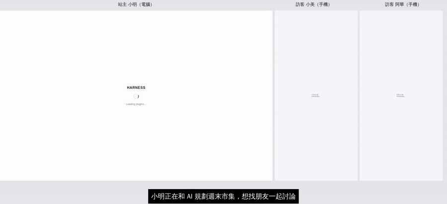
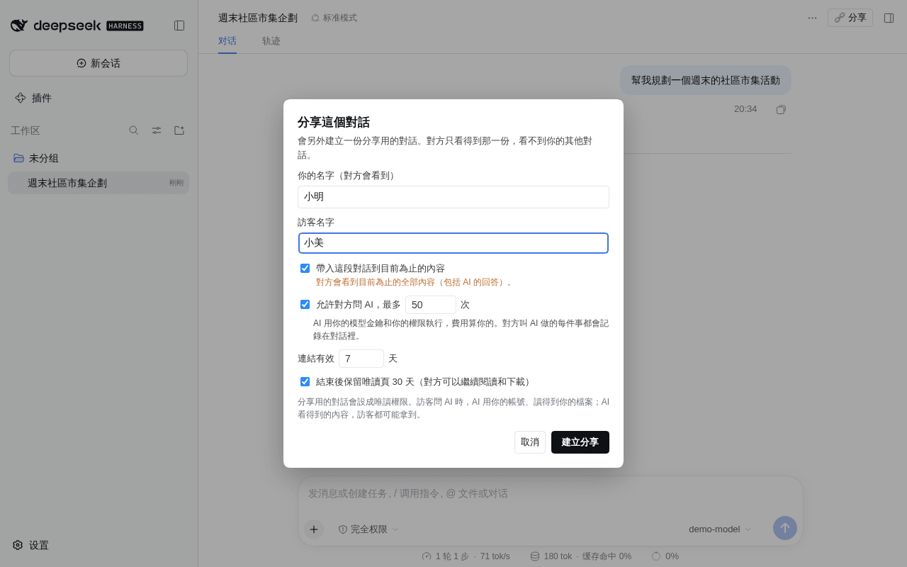
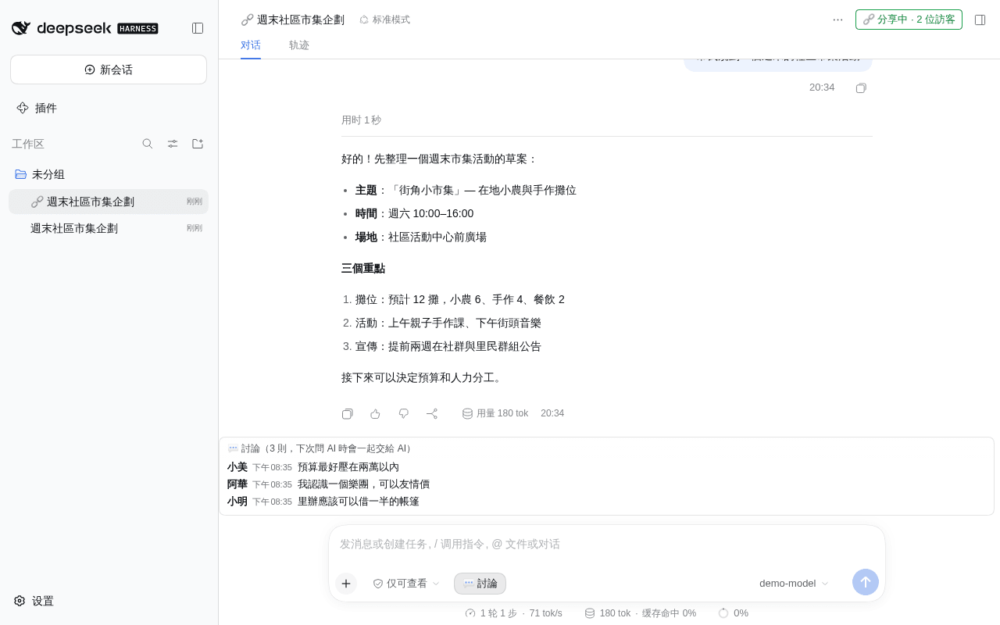
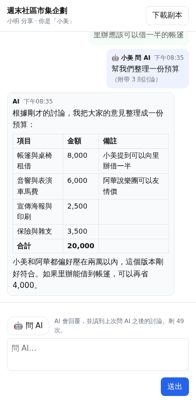
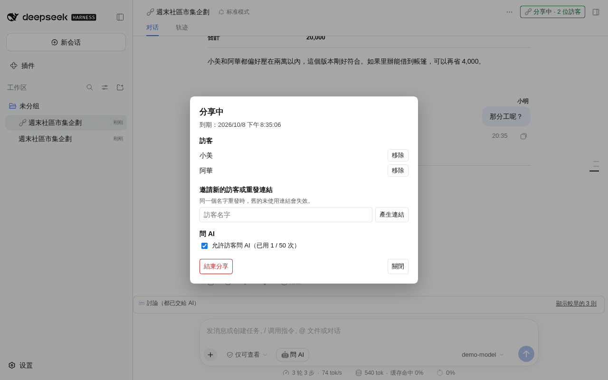
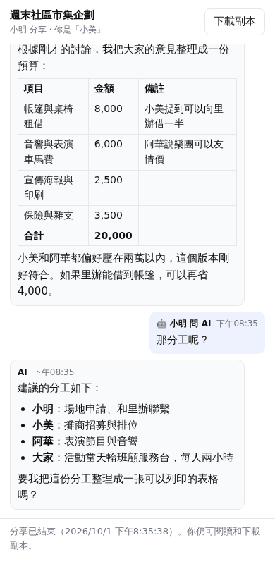

# dsh-share-room

[繁體中文](README.zh-TW.md) | [简体中文](README.zh-CN.md) | English

Share one [DeepSeek Harness (DSH)](https://github.com/deepseek-ai/deepseek-harness) conversation so others can discuss it with you and ask the AI. Guests join from a link in any browser. They don't need an account.



Full video with captions: [docs/media/demo.mp4](docs/media/demo.mp4)

> The UI text is currently in Traditional Chinese.

## What it does

- **One-click sharing.** Press **🔗 Share** in the conversation header. The plugin forks a separate copy for sharing, and your original conversation stays private.
- **No account needed.** Each guest gets their own single-use invite link and joins from a phone or a desktop. They don't need to install DSH or know your site password.
- **Group chat.** One share can have up to 20 guests, and everyone posts under their own name.
- **Two kinds of message:**
  - 💬 **Discuss**: people talk to each other, and the AI stays out of it.
  - 🤖 **Ask AI**: the AI reads the discussion since the last question, then answers. Everyone sees the answer.
- **Only this conversation.** Guests can't see your other conversations, files or settings.
- **Revocable at any time.** You can remove a guest, turn off guest questions, or end the share. Once it ends, guests can't post. You can keep a read-only page for them to read and download.
- **Site switch.** The whole feature can be turned off under Settings → General → 對話分享 (Conversation sharing).

## Screenshots

| Owner (desktop) | Guest (phone) |
|---|---|
|  |  |
|  |  |
|  |  |

## Before you share

Guests can ask **your** AI, and the AI answers with whatever it can see. dsh-share-room limits the damage, but it cannot make the AI keep a secret.

- **You pay.** The AI runs on your DSH with your model key, and every question is billed to you, whoever asks. Guest questions share one limit per share, 50 by default.
- **The shared conversation is read-only.** When a share is created, the plugin switches the forked conversation to DSH's `read-only` permission, so anything more needs your approval. If the switch fails, no share is created. If you raise the permission later, guests can't ask the AI until it is read-only again. Your original conversation keeps its own permission.
- **Read-only can still read.** The AI can read any file your DSH can read and put it in an answer. **Whatever the AI can see, a guest may get.** Share only with people you trust, and run the shared conversation in a workspace that holds only what it needs.
- **Guest text is marked untrusted.** The AI is told who is speaking and that guests are not the owner. A model can still be talked into things.
- **Everything is visible.** Every message and every AI action is recorded in the shared conversation, and you see it live. Ending a share also withdraws guest questions still in the queue. Content that guests have already seen, and actions the AI has already taken, can't be undone.
- **Bringing history shows everything so far.** If you tick 帶入這段對話到目前為止的內容 (bring in the conversation so far) when creating a share, guests see the whole conversation up to that point, AI answers included.
- **The guest page is on the same origin as your DSH.** It uses a strict CSP (`script-src 'self'`, no inline script) and treats everything as text. Markdown in AI answers becomes a fixed set of elements, and links and images stay inactive. Still, if an injection bug ever slipped through, the injected code would run with your login. For the strongest isolation, serve `/share/` from a separate hostname.

## Install

You need:

- DSH `0.1.5-rc.1` or `0.1.7-rc.2` (both tested);
- Node.js 22 or later;
- an HTTPS address your guests can reach, such as a public domain or a tunnel.

Steps:

1. Put this repo in your DSH web profile as `node_modules/dsh-share-room`:

   ```bash
   cd <your DSH web profile>
   git clone --depth 1 --branch v0.1.0 https://github.com/yillkid/dsh-share-room.git node_modules/dsh-share-room
   ```

2. In the profile's `package.json`, add `"dsh-share-room"` to `dsh.profile.bundles`.
3. Restart DSH. **🔗 Share** appears in the conversation header.

Where things live:

- The owner API is `/api/share-room.*` and uses DSH's own login.
- Guest pages live under `/share/<id>/`, and the plugin authenticates guests itself.
- If a site-wide login gate sits in front of DSH (for example `@summersec/dsh-web-auth`), it must let `/share/` through, **and only that**. See [docs/web-auth-public-prefixes.md](docs/web-auth-public-prefixes.md).
- Behind an HTTPS reverse proxy that sends `X-Forwarded-Proto: https`, guest cookies get `Secure` automatically. Set `SHARE_ROOM_SECURE_COOKIE=1` to force it on.

### On/off switch

Sharing is on after install. The owner can turn it off under Settings → General → 對話分享 (Conversation sharing). While it is off:

- nobody can create a new share or invite;
- every guest sees 分享暫停中 (sharing paused) right away.

Nothing is deleted: shares, links and records stay, and everything resumes when sharing is switched back on.

A site template can make it off by default with `config: { enabled: false }` for `share-room` in `cordis.patch.yml`. The owner's own choice wins.

## Development

```bash
node --test test/*.test.js        # unit and server tests, no DSH needed
node e2e/two-browsers.mjs         # two-browser end-to-end test on a throwaway DSH, see e2e/README.md
```

The design and decisions are in [PLAN.md](PLAN.md) (Chinese). Releases are in [CHANGELOG.md](CHANGELOG.md).

## License

[MIT](LICENSE)
